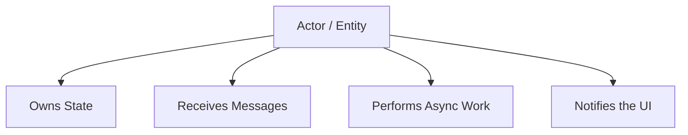
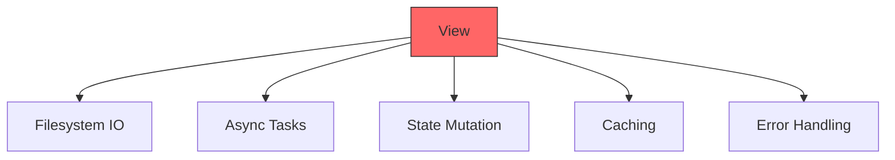
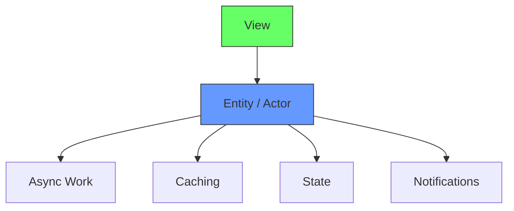
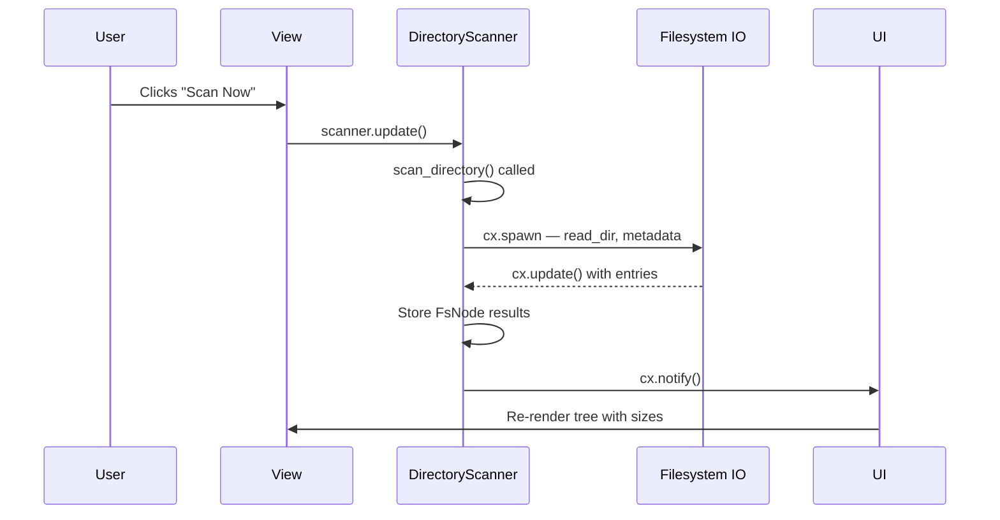
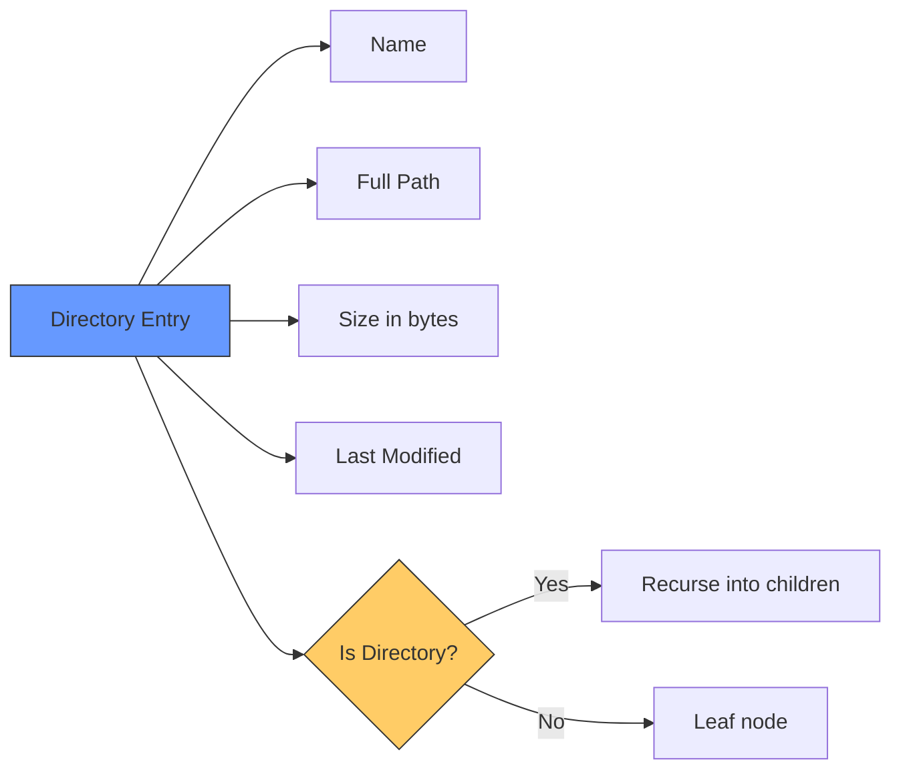
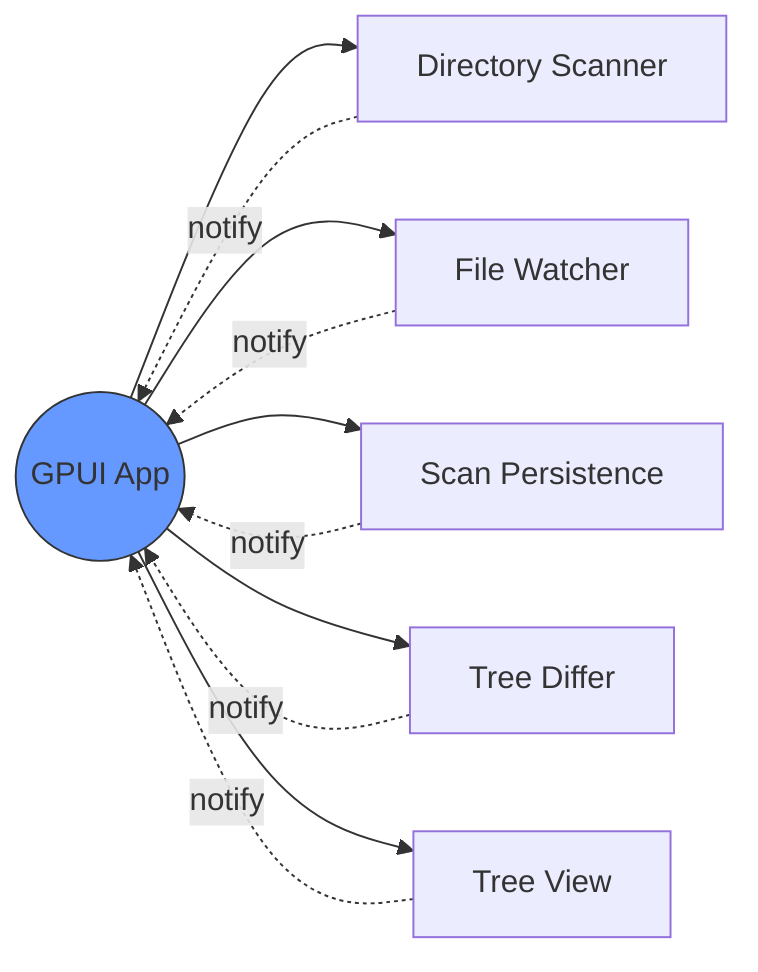

# The Entity / Actor Model in GPUI (Zed Editor)

The pattern that lets GPUI apps scale to hundreds of async operations without UI freezes.

## The Problem

How do you run lots of async work without blocking the single UI thread?

Scanning a directory tree — reading every file's size, last-modified date, and permissions — is heavy IO. Doing it on the UI thread freezes the window.

Zed solves this by treating stateful components as **actors** called **Entities**.

## The GPUI Entity / Actor Model

Think of each major subsystem as an actor:



Each actor is stored in GPUI as an `Entity<T>`:

```rust
Entity<DirectoryScanner>
Entity<FileWatcher>
Entity<ScanHistory>
Entity<FileTree>
```

Each entity:

- Owns its state
- Processes messages
- Schedules async tasks
- Updates the UI when needed

## Why Zed Uses This

Without actors, the view becomes a monolith:



That becomes spaghetti fast.

With actors, the view becomes thin:



## The Pattern

### 1. Define the Actor

```rust
struct DirectoryScanner {
    root_path: PathBuf,
    active_scans: usize,
    results: Vec<FsNode>,
}
```

### 2. Create an Entity

```rust
let scanner = cx.new_entity(DirectoryScanner::new(PathBuf::from("C:\\")));
// Returns Entity<DirectoryScanner>
// This entity is thread-safe and schedulable.
```

### 3. Send Messages to the Actor

From the UI:

```rust
scanner.update(cx, |scanner, cx| {
    scanner.scan_directory("/home/user/Documents", cx);
});
```

This runs inside the UI event loop safely.

### 4. Actor Performs Async Work

```rust
impl DirectoryScanner {
    pub fn scan_directory(&mut self, path: PathBuf, cx: &mut Context<Self>) {
        self.active_scans += 1;

        cx.spawn(async move {
            let mut entries = Vec::new();

            for entry in std::fs::read_dir(&path)? {
                let entry = entry?;
                let metadata = entry.metadata()?;

                entries.push(FsNode {
                    name: entry.file_name().to_string_lossy().into(),
                    path: entry.path(),
                    size: metadata.len(),
                    last_modified: metadata.modified().ok(),
                    is_dir: metadata.is_dir(),
                });
            }

            cx.update(|this, cx| {
                this.active_scans -= 1;
                this.results = entries;
                cx.notify();
            });
        });
    }
}
```

Key pieces:

- `spawn` — run filesystem IO off the UI thread
- `update` — safely modify actor state back on the UI thread
- `notify` — trigger a UI re-render

## Message Flow

Full pipeline from user clicking "Scan Now" to the tree rendering:



## Data Collected Per Entry

Each filesystem entry captures:



## Why This Scales

Storage Wars can run all of these simultaneously:

- Directory scanning (recursive IO)
- File metadata collection (size, modified date)
- Scan history persistence (SQLite)
- Tree diffing (baseline comparison)
- UI rendering (tree view updates)



This works because:

- Each subsystem is its own actor (`Entity<T>`)
- No giant shared state object
- Filesystem IO is isolated per actor — never on the UI thread
- UI updates happen through notifications, not direct mutation


## Appendix
this link is another attempt to solve this. Currently this is not performing well
https://chatgpt.com/c/69b08230-2158-83a0-ad43-eb1246b8e38c